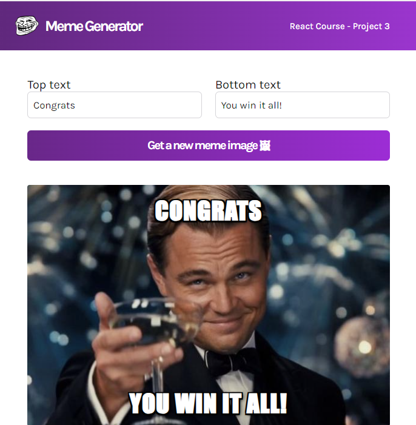

# Meme Generator

## Description
This app fetches a random image from the [Imgflip API](https://imgflip.com/api) and let you create your own meme by combine the image with your own text.

 

## Technologies
- HTML
- CSS
- JavaScript
- React
- REST

## Live link
The application is deployed here:
[https://zesty-centaur-5eda91.netlify.app](https://zesty-centaur-5eda91.netlify.app)

Please feel free to click around and explore!
